# Property Concierge — 현재 구현 구조와 확장 로드맵

> 한 줄 정의: 실거래 데이터와 AI를 활용해 매수 조건 정리부터 후보 분석·최종 선택·계약 및 잔금 준비까지 연결한 부동산 매수 의사결정 파이프라인

### 발표 자료용 그래프

- [현재 구현 파이프라인](./property_concierge_현재구현_파이프라인.svg)
- [미래 계획 로드맵](./property_concierge_미래계획_로드맵.svg)

## 1. 현재 구현된 매수 의사결정 파이프라인

```mermaid
flowchart LR
    U[사용자 요구사항<br/>지역·예산·면적·목적] --> I[입력 구조화]

    I --> G[주소·행정구역 확정]
    G -->|LLM: 검색 후보 생성| GC[후보 명칭]
    GC -->|API·규칙: 공식 주소·좌표·유형 확정| R[지역 탐색]

    R --> RT[(국토부 실거래가<br/>PostgreSQL)]
    RT --> RS[지역 통계<br/>중앙값·분위수·예산 적합률]
    RS --> C[매수 검토 케이스]

    C --> P[후보 매물 관리]
    P --> A[실거래 기반 AVM<br/>시세추정]
    P --> F[자금 시뮬레이션<br/>대출·세금·현금흐름]
    P --> L[권리관계 점검<br/>등기부·건축물대장]

    A --> X[후보별 분석 기록]
    F --> X
    L --> X
    X --> Q{분석 최신성 확인}
    Q -->|시세 30일<br/>자금 14일<br/>권리 7일| M[후보 2~4개 비교]
    M --> D[최종 후보와<br/>선택 근거 저장]

    D --> E[거래 실행 계획 자동 생성]
    E --> E1[계약 전]
    E --> E2[잔금 전]
    E --> E3[잔금일]
    E --> E4[거래 후]
    E1 --> V[확인자·결과·근거·후속 조치]
    E2 --> V
    E3 --> V
    E4 --> V
    V --> S[준비도·기한 경과·문제·외부 대기]

    classDef input fill:#e0f2fe,stroke:#0284c7,color:#0c4a6e;
    classDef data fill:#ecfdf5,stroke:#059669,color:#064e3b;
    classDef analysis fill:#f5f3ff,stroke:#7c3aed,color:#4c1d95;
    classDef decision fill:#fff7ed,stroke:#ea580c,color:#7c2d12;
    classDef execution fill:#fef2f2,stroke:#dc2626,color:#7f1d1d;
    class U,I,G,GC input;
    class R,RT,RS,C,P data;
    class A,F,L,X,Q analysis;
    class M,D decision;
    class E,E1,E2,E3,E4,V,S execution;
```

### 현재 구현 범위의 핵심

- LLM은 자연어를 검색 후보로 바꾸는 데 사용하고, 공식 주소·좌표·부동산 유형 확정은 API와 결정론적 규칙이 담당한다.
- 가격과 거래 통계는 LLM이 생성하지 않고 국토부 실거래가와 계산 로직이 산출한다.
- 시세·자금·권리 결과를 각각 끝내지 않고 동일한 후보 분석 기록에 연결한다.
- 최종 후보 선택 이후 계약·잔금 단계의 기본 작업 18개를 생성하고 실제 확인 결과를 기록한다.
- 현장 방문, 대출 심사, 계약 체결을 서비스가 대신 수행하지 않는다. 외부에서 수행한 결과를 기록하고 누락·위험을 추적한다.

### 데이터와 기능의 현실적 경계

| 영역 | 현재 상태 |
|---|---|
| 시세추정 | 국토부 실거래가 실데이터 기반 |
| 지역 통계 | 수집된 실거래가 기반 |
| 추천·비교용 개별 매물 | 개발용 가상 데이터 43건 또는 사용자 입력 후보 |
| 권리분석 문서 | 메모리에서 분석 후 즉시 파기 |
| 자금 시뮬레이션 | 조건 기반 예상값이며 금융기관 승인이 아님 |
| 실행 계획 일정 | 법정기한이 아닌 서비스 권장일 |

## 2. 목표 구조 — 거래 실행 지원 파이프라인

## 3. 제작 계획과 우선순위

### 포트폴리오 완성 범위

1. **작업별 증빙 문서**: 대출 승인서·계약서·영수증 등을 실행 작업에 연결한다.
2. **케이스 타임라인**: 후보 추가부터 분석, 선택, 일정 변경, 완료 확인까지 시간순으로 통합한다.
3. **일정·위험 알림**: 권장일 임박, 기한 경과, 문제 발견, 외부 확인 대기를 능동적으로 알린다.
4. **실제 자금 집행표**: 계약금·중도금·잔금·세금·중개보수와 자금 출처를 날짜별로 관리한다.
5. **계약서·특약 위험 점검**: LLM은 위험 문구 후보와 설명을 담당하고, 소유자·금액·날짜의 일치 여부는 규칙으로 검증한다.

### 외부 의존 확장 범위

- 매물 제휴가 확보되면 개발용 가상 매물을 실호가 데이터로 교체한다.
- 이메일·알림톡 사업자 연동 후 거래 일정 알림을 실제 발송한다.
- 역할별 접근 통제를 추가해 중개사·은행·법무사의 확인 결과를 같은 케이스에 연결한다.
- 매수 파이프라인을 기반으로 임대차·상업용·토지 거래별 절차 템플릿을 확장한다.

## 4. 포트폴리오 설명 문안

### 현재 구현 설명

> Property Concierge는 부동산 기능을 개별 화면으로 나열하는 대신, 사용자의 매수 조건을 구조화하고 지역 탐색, 후보 관리, 실거래 기반 시세추정, 자금 시뮬레이션, 권리관계 점검, 후보 비교와 최종 선택, 계약·잔금 실행 계획으로 연결한 매수 의사결정 파이프라인입니다. 가격과 통계는 데이터·계산 엔진이 담당하고 LLM은 자연어 해석과 설명에 한정했으며, 중요한 수치와 주소 확정에는 결정론적 검증을 적용했습니다.

### 향후 계획 설명

> 현재 최종 후보 선택 이후 기본 실행 작업과 확인 결과를 관리하는 단계까지 구현했습니다. 다음 단계에서는 작업별 증빙, 케이스 타임라인, 일정·위험 알림, 실제 자금 집행표, 계약 문서 점검을 추가해 의사결정 시스템을 거래 실행 지원 시스템으로 확장할 계획입니다. 실매물 연동과 전문가 협업은 외부 데이터 계약과 운영 체계가 필요한 확장 영역으로 명확히 구분했습니다.

### 발표용 한 문장

> 데이터로 후보를 좁히고, 근거를 남겨 최종 선택하며, 계약과 잔금 준비까지 끊기지 않게 연결한 부동산 매수 의사결정 파이프라인입니다.
